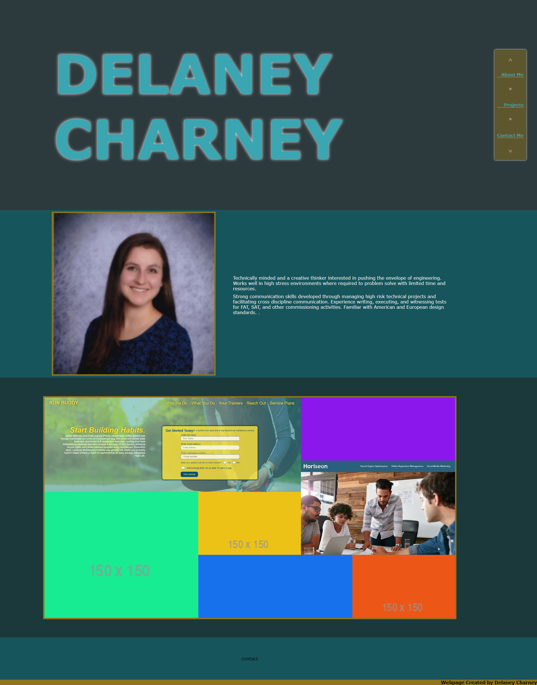

# Delaney Charney
## Project Engineer | Test Engineer
### BS Mechanical Engineering

Check out my work and contact information at https://dcharney.github.io/dcharney/!

<!--
**dcharney/dcharney** is a ✨ _special_ ✨ repository because its `README.md` (this file) appears on your GitHub profile.

### Challenge Assignment #2: Professional Portfolio

This webpage was built by Delaney Charney for Challenge Assignment No.2 of the UCF Coding Bootcamp. The requirements for the assignment are detailed below.

---

## User Story

    AS AN employer
        I WANT to view a potential employee's deployed portfolio of work samples
        SO THAT I can review samples of their work and assess whether they're a good candidate for an open position

---

## Acceptance Criteria

    GIVEN I need to sample a potential employee's previous work
        WHEN I load their portfolio
            THEN I am presented with the developer's name, a recent photo, and links to sections about them, their work, and how to contact them
        WHEN I click one of the links in the navigation
            THEN the UI scrolls to the corresponding section
        WHEN I click on the link to the section about their work
            THEN the UI scrolls to a section with titled images of the developer's applications
        WHEN I am presented with the developer's first application
            THEN that application's image should be larger in size than the others
        WHEN I click on the images of the applications
            THEN I am taken to that deployed application
        WHEN I resize the page or view the site on various screens and devices
            THEN I am presented with a responsive layout that adapts to my viewport

---

## Mock-Up

---

## Grading Requirements

This challenge is graded based on the following criteria:

### Technical Acceptance Criteria: 40%
    Satisfies all of the above acceptance criteria.

### Deployment: 32%
    Application deployed at live URL.
    Application loads with no errors.
    Application GitHub URL submitted.
    GitHub repository that contains application code.

### Application Quality: 15%
    Application resembles the mock-up functionality provided in the Challenge instructions.

### Repository Quality: 13%
    Repository has a unique name.
    Repository follows best practices for file structure and naming conventions.
    Repository follows best practices for class/id naming conventions, indentation, quality comments, etc.
    Repository contains multiple descriptive commit messages.
    Repository contains quality README file with description, screenshot, and link to deployed application.

-->